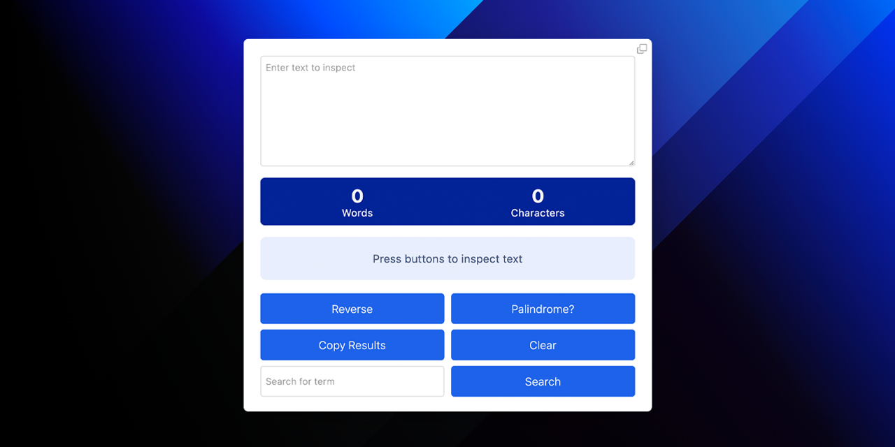

<p id="header"><p>

<table><tr>
<td> <a href="https://github.com/emjose/wordle-2/#header"></a> </td>
<td> <a href="https://github.com/emjose/one-hundred/#header"></a> </td>
<td> <a href="https://github.com/emjose/keto-food-list/#header"></a> </td>

</tr></table>

<br>

<p id="project-title"><p>

<a href=#table-of-contents></a>

<br>

<a href="https://inspectext.vercel.app/"></a>

#

<p id="table-of-contents"><p>

<a href=#table-of-contents></a>

-   [100 Days of Code](#100days)
-   [Installation](#installation)
-   [Live Site](#live-site)
-   [Resources](#resources)
-   [Let's Connect!](#lets-connect)

#

<p id="100days"><p>

<a href=#100days></a>

### Day 35: March 12, 2022

-   For job application essays, I needed a tool to keep track of word count.

-   **[InspecText](https://inspectext.vercel.app/)** is a word counting app, adapted from a <a href="https://www.youtube.com/watch?v=ArYsctCP9u8">tutorial</a> by the <a href="https://www.youtube.com/channel/UC15exV5s79D_aYGADudlwpQ">Coding Artist</a>.

-   Core features include word and character count, string reversal, substring search, and palindrome validation.

-   For enhanced functionality, the following features were implemented:

    -   Keyboard navigation
    -   Regex usage to handle edge cases
    -   Responsiveness to mobile landscape orientation
    -   Buttons for clearing text and copying to the clipboard.

-   InspecText was personally rewarding to create, as the process was a great education on the topics of validation, regular expressions, best practices, functionality, and refactoring.

#

<p id="installation"><p>

<a href=#installation></a>

#### Git clone and cd into the repo folder:

```console
git clone git@github.com:emjose/inspectext.git && cd inspectext
```

#### Run the command:

```console
open index.html
```

#

<p id="live-site"><p>

<a href="https://inspectext.vercel.app/"></a>

### To Mac Users:

-   A **period** may automatically insert after **double-spacing** in the textarea.

-   Instructions on **[how to disable this keyboard setting.](https://osxdaily.com/2019/03/27/disable-period-typing-shortcut-mac/)**

<a href="https://inspectext.vercel.app/"></a>

• **[InspecText](https://inspectext.vercel.app/)** counts words and characters, which include emojis, whitespaces, and line breaks.

• Users can reverse strings and search for substrings in text. Search is **case-insensitive**.

• Each **[emoji](https://unicode.org/faq/emoji_dingbats.html)** will register as one word comprised of two or more characters</a>.

• A reversed emoji may appear as �� ([replacement characters](<https://en.wikipedia.org/wiki/Specials_(Unicode_block)>)) if its **backwards** unicode sequence is invalid.

<a href=#live-site></a>

<details>
<summary><b>GIF demo: Copying and clearing text</b></summary>
<br>

<a href="https://inspectext.vercel.app/"></a>

• Users can clear text and reset the app.

• The textarea or inspection results can be copied to the clipboard.

#

</details>

<details>
<summary><b>GIF demo: Palindrome validation</b></summary>
<br>

<a href="https://inspectext.vercel.app/"></a>

• Users can test strings for palindrome validation.

• Whitespaces, capitalization, and punctuation characters are ignored.

<br>

### Invalid Palindrome Scenarios:

• Strings that only contain punctuation characters.

• Strings with emojis and/or non-alphanumeric characters.

• Alphanumeric strings that do **not** read the same forwards or backwards.

</details>

#

<p id="palindrome-examples"><p>

<a href=#palindrome-examples></a>

<details>
<summary><b>Words, Names, and Dates</b></summary>

-   I
-   a
-   yay
-   wow
-   Otto
-   civic
-   Anna
-   tenet
-   kayak
-   rotator
-   racecar
-   Hannah
-   2/22/22

</details>

<details>
<summary><b>Phrases and Sentences</b></summary>

-   Step on no pets!
-   Stressed desserts
-   So many dynamos.
-   Never odd or even.
-   Won't lovers revolt now?
-   Oozy rat in a sanitary zoo.
-   Murder for a jar of red rum.
-   Oh, who was it I saw? Oh, who?
-   Did Hannah see bees? Hannah did.
-   Cigar? Toss it in a can. It is so tragic.
-   Are we not drawn onward, we few, drawn onward to new era?
-   Are we not pure? “No, sir!” Panama’s moody Noriega brags. “It is garbage!” Irony dooms a man—a prisoner up to new era.

</details>

#

<p id="resources"><p>

<a href=#resources></a>

-   #### [Octicons](https://primer.style/octicons/)
-   #### [RegexBuddy](https://www.regular-expressions.info/unicode.html)
-   #### [Adobe Fonts](https://fonts.adobe.com/)
-   #### [Regex Function](https://www.terraform.io/language/functions/regex)
-   #### [The test() method](https://developer.mozilla.org/en-US/docs/Web/JavaScript/Reference/Global_Objects/RegExp/test)
-   #### [Detecting All Emojis](https://localcoder.org/detecting-all-emojis)
-   #### [Full Emoji List, v14.0](https://unicode.org/emoji/charts/full-emoji-list.html)
-   #### [Clipboard.writeText()](https://developer.mozilla.org/en-US/docs/Web/API/Clipboard/writeText)
-   #### [Unicode Property Escapes](https://developer.mozilla.org/en-US/docs/Web/JavaScript/Guide/Regular_Expressions/Unicode_Property_Escapes)
-   #### [175 Best Palindromes in English](https://czechtheworld.com/best-palindromes/)
-   #### [Copy to Clipboard with JavaScript](https://www.youtube.com/watch?v=3o2XgPkDrKI)
-   #### [16 Surprisingly Funny Palindromes](https://www.grammarly.com/blog/16-surprisingly-funny-palindromes/)
-   #### [Fun with Text Tutorial](https://www.youtube.com/watch?v=ArYsctCP9u8) by [Coding Artist](https://www.youtube.com/c/CodingArtist)
-   #### [Regular Expression Syntax Cheatsheet](https://developer.mozilla.org/en-US/docs/Web/JavaScript/Guide/Regular_Expressions/Cheatsheet)
-   #### [50+ Palindrome Sentences And Names](https://www.scarymommy.com/palindrome-sentences)
-   #### [Twitter Now Counts Every Emoji as Equal](https://blog.emojipedia.org/twitter-now-counts-every-emoji-as-equal/#:~:text=The%20limit%20of%20280%20characters,use%20a%20consistent%20two%20characters.)
-   #### [My blog on how I created my Github READMEs](https://emmanueljose.medium.com/readme-a-makeover-story-b9c7be37a6de?sk=7ae6623d365409d875753e4604e42ffd)

#

<p id="lets-connect"><p>

<a href=#lets-connect></a>

<p><a href="https://twitter.com/Emmanuel_Labor"></a> <a href="https://www.linkedin.com/in/emmanuelpjose/"></a> <a href="https://emmanueljose.medium.com/"></a> <a href="https://www.instagram.com/emmanuel_jose/"></a> <a href="mailto:emjose@gmail.com"></a> <a href="https://www.emmanuel-jose.com/"></a> <a href="https://github.com/emjose"></a></p>

#

<a href=#header></a>
